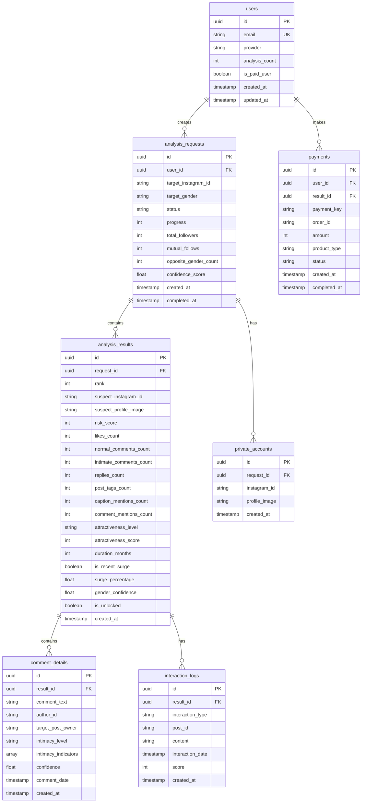

# AI 바람감지기 MVP - PRD (Product Requirements Document)

## 📋 개요

AI가 애인의 인스타그램을 분석해 바람 위험도가 높은 인물을 찾아주는 서비스의 MVP 기술 명세서입니다.

---

## 1. 프로젝트 구조

> **확장성 참고**: MVP에서는 Next.js Full-stack Monorepo로 시작합니다.
> 추후 프론트/백엔드 분리 배포나 팀 협업이 필요할 경우, `lib/services/`를 별도 패키지로 추출하여 Turborepo 구조로 전환할 수 있습니다.

```
ai-baram-detector/
├── app/                              # Next.js App Router
│   ├── layout.tsx                    # 루트 레이아웃
│   ├── page.tsx                      # 랜딩 페이지
│   ├── globals.css                   # 글로벌 스타일
│   │
│   ├── (auth)/                       # 인증 관련 라우트
│   │   ├── login/
│   │   │   └── page.tsx              # 로그인 페이지
│   │   └── callback/
│   │       └── route.ts              # OAuth 콜백 핸들러
│   │
│   ├── (main)/                       # 메인 서비스 라우트
│   │   ├── layout.tsx                # 인증 필요 레이아웃
│   │   ├── analyze/
│   │   │   └── page.tsx              # 분석 입력 페이지
│   │   ├── progress/
│   │   │   └── [requestId]/
│   │   │       └── page.tsx          # 분석 진행 상황 페이지
│   │   └── result/
│   │       └── [requestId]/
│   │           └── page.tsx          # 결과 리포트 페이지
│   │
│   └── api/                          # API Routes
│       ├── analysis/
│       │   ├── start/
│       │   │   └── route.ts          # 분석 시작 API
│       │   ├── status/
│       │   │   └── [requestId]/
│       │   │       └── route.ts      # 분석 상태 조회 API
│       │   └── result/
│       │       └── [requestId]/
│       │           └── route.ts      # 분석 결과 조회 API
│       ├── payment/
│       │   ├── create/
│       │   │   └── route.ts          # 결제 세션 생성
│       │   └── webhook/
│       │       └── route.ts          # 결제 웹훅 처리
│       └── webhooks/
│           └── email/
│               └── route.ts          # 이메일 알림 트리거
│
├── components/                       # React 컴포넌트
│   ├── ui/                           # 기본 UI 컴포넌트
│   │   ├── button.tsx
│   │   ├── input.tsx
│   │   ├── card.tsx
│   │   ├── modal.tsx
│   │   ├── progress-bar.tsx
│   │   └── loading-spinner.tsx
│   │
│   ├── layout/                       # 레이아웃 컴포넌트
│   │   ├── header.tsx
│   │   ├── footer.tsx
│   │   └── mobile-nav.tsx
│   │
│   ├── landing/                      # 랜딩 페이지 컴포넌트
│   │   ├── hero-section.tsx
│   │   ├── how-it-works.tsx
│   │   ├── trust-indicators.tsx
│   │   └── disclaimer.tsx
│   │
│   ├── analyze/                      # 분석 관련 컴포넌트
│   │   ├── instagram-id-form.tsx
│   │   ├── gender-selector.tsx
│   │   └── public-account-notice.tsx
│   │
│   ├── progress/                     # 진행 상황 컴포넌트
│   │   ├── progress-tracker.tsx
│   │   ├── step-checklist.tsx
│   │   └── email-notification-info.tsx
│   │
│   └── result/                       # 결과 화면 컴포넌트
│       ├── analysis-summary.tsx
│       ├── rank-card.tsx
│       ├── private-accounts-list.tsx
│       ├── unlock-prompt.tsx
│       ├── share-buttons.tsx
│       └── deep-scan-beta-modal.tsx
│
├── lib/                              # 유틸리티 & 서비스
│   ├── supabase/
│   │   ├── client.ts                 # Supabase 클라이언트 (브라우저)
│   │   ├── server.ts                 # Supabase 서버 클라이언트
│   │   └── admin.ts                  # Supabase Admin 클라이언트
│   │
│   ├── services/
│   │   ├── instagram/
│   │   │   ├── scraper.ts            # Apify 스크래핑 서비스
│   │   │   ├── profile.ts            # 프로필 정보 수집
│   │   │   ├── followers.ts          # 팔로워/팔로잉 수집
│   │   │   ├── posts.ts              # 게시물 수집
│   │   │   └── interactions.ts       # 상호작용 수집
│   │   │
│   │   ├── ai/
│   │   │   ├── gemini.ts             # Gemini API 클라이언트
│   │   │   ├── gender-analysis.ts    # 성별 판단 로직
│   │   │   ├── appearance-analysis.ts # 외모 분석 로직
│   │   │   └── intimacy-analysis.ts  # 댓글 친밀도 분석 로직
│   │   │
│   │   ├── analysis/
│   │   │   ├── risk-score.ts         # 위험도 점수 계산
│   │   │   ├── confidence-score.ts   # 신뢰도 점수 계산
│   │   │   └── pipeline.ts           # 전체 분석 파이프라인
│   │   │
│   │   ├── email.ts                  # Resend 이메일 서비스
│   │   ├── payment.ts                # 결제 서비스
│   │   └── analytics.ts              # Amplitude 이벤트 트래킹
│   │
│   ├── constants/
│   │   ├── scoring.ts                # 점수 계산 상수
│   │   └── prompts.ts                # AI 프롬프트 상수
│   │
│   ├── types/
│   │   ├── database.ts               # DB 타입 정의
│   │   ├── instagram.ts              # 인스타그램 관련 타입
│   │   └── analysis.ts               # 분석 관련 타입
│   │
│   └── utils/
│       ├── masking.ts                # ID/이미지 마스킹 유틸
│       ├── date.ts                   # 날짜 처리 유틸
│       └── validation.ts             # 입력 검증 유틸
│
├── hooks/                            # 커스텀 React 훅
│   ├── useAuth.ts                    # 인증 상태 관리
│   ├── useAnalysis.ts                # 분석 상태 관리
│   └── useRealtime.ts                # Supabase Realtime 구독
│
├── supabase/                         # Supabase 관련 파일
│   ├── migrations/                   # DB 마이그레이션
│   │   └── 001_initial_schema.sql
│   └── functions/                    # Edge Functions
│       └── analyze-instagram/        # 분석 백그라운드 작업
│           └── index.ts
│
├── public/                           # 정적 파일
│   ├── icons/
│   ├── images/
│   └── manifest.json
│
├── .env.example                      # 환경 변수 예시
├── .env.local                        # 로컬 환경 변수 (gitignore)
├── tailwind.config.ts
├── next.config.mjs
├── package.json
└── README.md
```

---

## 2. 기술 스택

| 영역 | 기술 | 버전 | 비고 |
|------|------|------|------|
| **프론트엔드** | Next.js (App Router) | 14.x | React 18 |
| **스타일링** | Tailwind CSS | 3.x | 모바일 First |
| **배포** | Vercel | - | Free Plan |
| **백엔드/DB** | Supabase | - | Hobby (Free) |
| **인증** | Supabase Auth | - | 카카오/구글 OAuth |
| **실시간** | Supabase Realtime | - | 진행률 업데이트 |
| **백그라운드 작업** | Supabase Edge Functions | - | Deno 기반 |
| **인스타 스크래핑** | Apify | - | Free ($5/월 크레딧) |
| **AI 분석** | Google Gemini 3.0 Flash | - | 종량제 |
| **이메일** | Resend | - | Free (100/일) |
| **결제** | Polar | - | USD 결제 |
| **애널리틱스** | Amplitude | - | Free |

---

## 3. 환경 변수

```bash
# .env.example

# Supabase
NEXT_PUBLIC_SUPABASE_URL=https://xxx.supabase.co
NEXT_PUBLIC_SUPABASE_ANON_KEY=xxx
SUPABASE_SERVICE_ROLE_KEY=xxx

# OAuth (카카오)
KAKAO_CLIENT_ID=xxx
KAKAO_CLIENT_SECRET=xxx

# OAuth (구글)
GOOGLE_CLIENT_ID=xxx
GOOGLE_CLIENT_SECRET=xxx

# Apify
APIFY_API_TOKEN=xxx

# Gemini AI
GEMINI_API_KEY=xxx

# Resend (이메일)
RESEND_API_KEY=xxx
RESEND_FROM_EMAIL=noreply@baram-detector.com

# 결제 (Polar)
POLAR_ACCESS_TOKEN=xxx
POLAR_ORGANIZATION_ID=xxx
NEXT_PUBLIC_POLAR_CHECKOUT_LINK_UNLOCK=xxx
NEXT_PUBLIC_POLAR_CHECKOUT_LINK_DEEPSCAN=xxx

# Amplitude
NEXT_PUBLIC_AMPLITUDE_API_KEY=xxx

# App
NEXT_PUBLIC_APP_URL=https://baram-detector.com
```

---

## 4. 데이터베이스 스키마

### 4.1 ERD


### 4.2 SQL 마이그레이션

```sql
-- 001_initial_schema.sql

-- UUID 확장 활성화
CREATE EXTENSION IF NOT EXISTS "uuid-ossp";

-- 1. 사용자 테이블
CREATE TABLE users (
    id UUID PRIMARY KEY DEFAULT uuid_generate_v4(),
    email VARCHAR(255) UNIQUE NOT NULL,
    provider VARCHAR(50) NOT NULL,  -- 'google' | 'kakao'
    analysis_count INTEGER DEFAULT 0,
    is_paid_user BOOLEAN DEFAULT FALSE,
    created_at TIMESTAMP WITH TIME ZONE DEFAULT NOW(),
    updated_at TIMESTAMP WITH TIME ZONE DEFAULT NOW()
);

-- 2. 분석 요청 테이블
CREATE TABLE analysis_requests (
    id UUID PRIMARY KEY DEFAULT uuid_generate_v4(),
    user_id UUID NOT NULL REFERENCES users(id) ON DELETE CASCADE,
    target_instagram_id VARCHAR(100) NOT NULL,
    target_gender VARCHAR(10) NOT NULL CHECK (target_gender IN ('male', 'female')),
    status VARCHAR(20) DEFAULT 'pending' CHECK (status IN ('pending', 'processing', 'completed', 'failed')),
    progress INTEGER DEFAULT 0 CHECK (progress >= 0 AND progress <= 100),
    progress_step VARCHAR(50),  -- 현재 진행 단계 설명
    total_followers INTEGER,
    mutual_follows INTEGER,
    opposite_gender_count INTEGER,
    confidence_score FLOAT,
    error_message TEXT,
    created_at TIMESTAMP WITH TIME ZONE DEFAULT NOW(),
    completed_at TIMESTAMP WITH TIME ZONE
);

-- 3. 분석 결과 테이블
CREATE TABLE analysis_results (
    id UUID PRIMARY KEY DEFAULT uuid_generate_v4(),
    request_id UUID NOT NULL REFERENCES analysis_requests(id) ON DELETE CASCADE,
    rank INTEGER NOT NULL,  -- 1위, 2위, ...
    suspect_instagram_id VARCHAR(100) NOT NULL,
    suspect_profile_image TEXT,
    risk_score INTEGER NOT NULL DEFAULT 0,
    
    -- 상호작용 카운트
    likes_count INTEGER DEFAULT 0,
    normal_comments_count INTEGER DEFAULT 0,
    intimate_comments_count INTEGER DEFAULT 0,
    replies_count INTEGER DEFAULT 0,
    post_tags_count INTEGER DEFAULT 0,
    caption_mentions_count INTEGER DEFAULT 0,
    comment_mentions_count INTEGER DEFAULT 0,
    
    -- AI 분석 결과
    attractiveness_level VARCHAR(10) CHECK (attractiveness_level IN ('high', 'medium', 'low')),
    attractiveness_score INTEGER DEFAULT 0,
    gender_confidence FLOAT,
    
    -- 기간 및 급증 분석
    first_interaction_date TIMESTAMP WITH TIME ZONE,
    duration_months INTEGER,
    is_recent_surge BOOLEAN DEFAULT FALSE,
    surge_percentage FLOAT,
    
    -- 결제 상태
    is_unlocked BOOLEAN DEFAULT FALSE,
    
    created_at TIMESTAMP WITH TIME ZONE DEFAULT NOW()
);

-- 4. 댓글 상세 테이블
CREATE TABLE comment_details (
    id UUID PRIMARY KEY DEFAULT uuid_generate_v4(),
    result_id UUID NOT NULL REFERENCES analysis_results(id) ON DELETE CASCADE,
    comment_text TEXT NOT NULL,
    author_id VARCHAR(100) NOT NULL,  -- 댓글 작성자
    target_post_owner VARCHAR(100) NOT NULL,  -- 게시물 주인
    intimacy_level VARCHAR(10) CHECK (intimacy_level IN ('intimate', 'normal')),
    intimacy_indicators TEXT[],  -- 발견된 친밀도 지표들
    confidence FLOAT,
    comment_date TIMESTAMP WITH TIME ZONE,
    created_at TIMESTAMP WITH TIME ZONE DEFAULT NOW()
);

-- 5. 상호작용 로그 테이블
CREATE TABLE interaction_logs (
    id UUID PRIMARY KEY DEFAULT uuid_generate_v4(),
    result_id UUID NOT NULL REFERENCES analysis_results(id) ON DELETE CASCADE,
    interaction_type VARCHAR(20) NOT NULL CHECK (interaction_type IN ('like', 'comment', 'reply', 'post_tag', 'caption_mention', 'comment_mention')),
    post_id VARCHAR(100),
    content TEXT,  -- 댓글 내용 등
    interaction_date TIMESTAMP WITH TIME ZONE,
    score INTEGER DEFAULT 0,
    created_at TIMESTAMP WITH TIME ZONE DEFAULT NOW()
);

-- 6. 비공개 계정 테이블
CREATE TABLE private_accounts (
    id UUID PRIMARY KEY DEFAULT uuid_generate_v4(),
    request_id UUID NOT NULL REFERENCES analysis_requests(id) ON DELETE CASCADE,
    instagram_id VARCHAR(100) NOT NULL,
    profile_image TEXT,
    created_at TIMESTAMP WITH TIME ZONE DEFAULT NOW()
);

-- 7. 결제 테이블
CREATE TABLE payments (
    id UUID PRIMARY KEY DEFAULT uuid_generate_v4(),
    user_id UUID NOT NULL REFERENCES users(id) ON DELETE CASCADE,
    result_id UUID REFERENCES analysis_results(id) ON DELETE SET NULL,
    payment_key VARCHAR(200),  -- Polar checkout ID
    order_id VARCHAR(100) UNIQUE NOT NULL,
    amount INTEGER NOT NULL,
    product_type VARCHAR(20) NOT NULL CHECK (product_type IN ('unlock_rank', 'deep_scan')),
    status VARCHAR(20) DEFAULT 'pending' CHECK (status IN ('pending', 'completed', 'failed', 'cancelled')),
    created_at TIMESTAMP WITH TIME ZONE DEFAULT NOW(),
    completed_at TIMESTAMP WITH TIME ZONE
);

-- 인덱스 생성
CREATE INDEX idx_analysis_requests_user_id ON analysis_requests(user_id);
CREATE INDEX idx_analysis_requests_status ON analysis_requests(status);
CREATE INDEX idx_analysis_results_request_id ON analysis_results(request_id);
CREATE INDEX idx_analysis_results_rank ON analysis_results(rank);
CREATE INDEX idx_comment_details_result_id ON comment_details(result_id);
CREATE INDEX idx_interaction_logs_result_id ON interaction_logs(result_id);
CREATE INDEX idx_private_accounts_request_id ON private_accounts(request_id);
CREATE INDEX idx_payments_user_id ON payments(user_id);
CREATE INDEX idx_payments_order_id ON payments(order_id);

-- RLS (Row Level Security) 활성화
ALTER TABLE users ENABLE ROW LEVEL SECURITY;
ALTER TABLE analysis_requests ENABLE ROW LEVEL SECURITY;
ALTER TABLE analysis_results ENABLE ROW LEVEL SECURITY;
ALTER TABLE comment_details ENABLE ROW LEVEL SECURITY;
ALTER TABLE interaction_logs ENABLE ROW LEVEL SECURITY;
ALTER TABLE private_accounts ENABLE ROW LEVEL SECURITY;
ALTER TABLE payments ENABLE ROW LEVEL SECURITY;

-- RLS 정책: 사용자는 자신의 데이터만 접근 가능
CREATE POLICY "Users can view own data" ON users
    FOR SELECT USING (auth.uid() = id);

CREATE POLICY "Users can view own analysis requests" ON analysis_requests
    FOR SELECT USING (auth.uid() = user_id);

CREATE POLICY "Users can insert own analysis requests" ON analysis_requests
    FOR INSERT WITH CHECK (auth.uid() = user_id);

CREATE POLICY "Users can view own analysis results" ON analysis_results
    FOR SELECT USING (
        EXISTS (
            SELECT 1 FROM analysis_requests 
            WHERE analysis_requests.id = analysis_results.request_id 
            AND analysis_requests.user_id = auth.uid()
        )
    );

CREATE POLICY "Users can view own comment details" ON comment_details
    FOR SELECT USING (
        EXISTS (
            SELECT 1 FROM analysis_results
            JOIN analysis_requests ON analysis_requests.id = analysis_results.request_id
            WHERE analysis_results.id = comment_details.result_id
            AND analysis_requests.user_id = auth.uid()
        )
    );

CREATE POLICY "Users can view own interaction logs" ON interaction_logs
    FOR SELECT USING (
        EXISTS (
            SELECT 1 FROM analysis_results
            JOIN analysis_requests ON analysis_requests.id = analysis_results.request_id
            WHERE analysis_results.id = interaction_logs.result_id
            AND analysis_requests.user_id = auth.uid()
        )
    );

CREATE POLICY "Users can view own private accounts" ON private_accounts
    FOR SELECT USING (
        EXISTS (
            SELECT 1 FROM analysis_requests 
            WHERE analysis_requests.id = private_accounts.request_id 
            AND analysis_requests.user_id = auth.uid()
        )
    );

CREATE POLICY "Users can view own payments" ON payments
    FOR SELECT USING (auth.uid() = user_id);

CREATE POLICY "Users can insert own payments" ON payments
    FOR INSERT WITH CHECK (auth.uid() = user_id);

-- Realtime 활성화 (분석 진행 상황 실시간 업데이트)
ALTER PUBLICATION supabase_realtime ADD TABLE analysis_requests;

-- 업데이트 시 updated_at 자동 갱신 트리거
CREATE OR REPLACE FUNCTION update_updated_at_column()
RETURNS TRIGGER AS $$
BEGIN
    NEW.updated_at = NOW();
    RETURN NEW;
END;
$$ language 'plpgsql';

CREATE TRIGGER update_users_updated_at
    BEFORE UPDATE ON users
    FOR EACH ROW
    EXECUTE FUNCTION update_updated_at_column();
```

---

## 5. API 명세

### 5.1 인증 API

#### POST `/api/auth/callback`
OAuth 콜백 처리 (카카오/구글)

Supabase Auth에서 자동 처리됨

---

### 5.2 분석 API

#### POST `/api/analysis/start`
새로운 분석 시작

**Request:**
```json
{
  "targetInstagramId": "boyfriend_123",
  "targetGender": "male"
}
```

**Response (201):**
```json
{
  "success": true,
  "requestId": "uuid-here",
  "message": "분석이 시작되었습니다."
}
```

**Error Responses:**
- `400` - 잘못된 입력값
- `401` - 인증 필요
- `403` - 무료 분석 횟수 초과
- `404` - 존재하지 않거나 비공개 계정

---

#### GET `/api/analysis/status/[requestId]`
분석 진행 상태 조회

**Response (200):**
```json
{
  "requestId": "uuid-here",
  "status": "processing",
  "progress": 45,
  "progressStep": "맞팔 계정 성별 판단 중...",
  "createdAt": "2025-01-22T10:00:00Z",
  "estimatedCompletionTime": "2025-01-22T10:05:00Z"
}
```

**Status Values:**
- `pending` - 대기 중
- `processing` - 분석 중
- `completed` - 완료
- `failed` - 실패

---

#### GET `/api/analysis/result/[requestId]`
분석 결과 조회

**Response (200):**
```json
{
  "requestId": "uuid-here",
  "status": "completed",
  "summary": {
    "targetInstagramId": "boyfriend_123",
    "totalFollowers": 523,
    "mutualFollows": 152,
    "oppositeGenderCount": 47,
    "privateAccountsCount": 23,
    "confidenceScore": 87.5
  },
  "topResult": {
    "rank": 1,
    "instagramId": "su***_kim",
    "profileImage": "https://...(blurred)",
    "riskScore": 847,
    "interactions": {
      "likes": 34,
      "normalComments": 8,
      "intimateComments": 4,
      "replies": 3,
      "postTags": 1,
      "captionMentions": 0
    },
    "attractivenessLevel": "high",
    "durationMonths": 14,
    "isRecentSurge": true,
    "surgePercentage": 250
  },
  "lockedResults": [
    {
      "rank": 2,
      "riskScore": 723,
      "isUnlocked": false,
      "unlockPrice": 4900
    },
    {
      "rank": 3,
      "riskScore": 612,
      "isUnlocked": false,
      "unlockPrice": 4900
    }
  ],
  "privateAccounts": [
    {
      "instagramId": "pr***te_1",
      "profileImage": "https://..."
    }
  ]
}
```

---

### 5.3 결제 API

#### POST `/api/payment/create`
결제 세션 생성

**Request:**
```json
{
  "resultId": "uuid-here",
  "productType": "unlock_rank"
}
```

**Response (201):**
```json
{
  "success": true,
  "orderId": "order-uuid",
  "amount": 4900,
  "paymentWidget": {
    "clientKey": "xxx",
    "customerKey": "user-uuid"
  }
}
```

---

#### POST `/api/payment/webhook`
결제 완료 웹훅 (Polar)

**Request (from Polar):**
```json
{
  "type": "checkout.completed",
  "data": {
    "id": "checkout-uuid",
    "customer_email": "user@example.com",
    "amount": 499,
    "currency": "usd",
    "metadata": {
      "resultId": "uuid-here",
      "productType": "unlock_rank"
    }
  }
}
```

**Response (200):**
```json
{
  "success": true
}
```

---

### 5.4 이메일 알림 API

#### POST `/api/webhooks/email`
분석 완료 이메일 발송 (내부 트리거)

**Request:**
```json
{
  "requestId": "uuid-here",
  "type": "analysis_complete"
}
```

**Response (200):**
```json
{
  "success": true,
  "messageId": "resend-message-id"
}
```

---

## 6. AI 프롬프트 정의

### 6.1 성별 판단 프롬프트

```typescript
// lib/constants/prompts.ts

export const GENDER_ANALYSIS_PROMPT = `
당신은 인스타그램 계정의 성별을 판단하는 AI입니다.
제공된 정보를 종합적으로 분석하여 계정 주인의 성별을 판단해주세요.

## 분석 대상 정보
- 프로필 사진: {profileImageDescription}
- 사용자명: {username}
- 표시 이름: {fullName}
- 바이오: {bio}
- 최근 피드 이미지 설명: {feedImagesDescription}

## 판단 기준
1. 프로필/피드 사진에서 보이는 신체적 특징
2. 이름, 사용자명에서의 성별 힌트 (여성: 지민, 수아 / 남성: 현우, 민수 등)
3. 바이오에서의 성별 관련 표현 (언니, 오빠, she/her, he/him 등)
4. 패션, 메이크업, 헤어스타일 등 스타일 요소
5. 피드 전반의 분위기와 주제

## 응답 형식 (JSON만 출력)
{
  "gender": "male" | "female" | "unknown",
  "confidence": 0.0 ~ 1.0,
  "reasoning": "판단 근거를 2-3문장으로 설명"
}

## 중요 규칙
- confidence 0.7 미만인 경우 "unknown"으로 응답
- 기업/브랜드/그룹 계정은 "unknown"으로 처리
- 사진이 없거나 불명확한 경우 텍스트 정보에 더 의존
- 반드시 유효한 JSON 형식으로만 응답
`;
```

### 6.2 외모 분석 프롬프트

```typescript
export const APPEARANCE_ANALYSIS_PROMPT = `
당신은 인스타그램 계정 주인의 외모를 분석하는 AI입니다.
대중적 선호도 기준으로 객관적인 평가를 수행합니다.

## 분석 대상 이미지
{imageDescriptions}

## 계정 주인 식별 방법
1. 프로필 사진과 유사한 인물 찾기
2. 독사진(1인 사진)에서 반복 등장하는 인물
3. 여러 피드에서 일관되게 등장하는 인물

## 평가 기준
- 얼굴 비율과 대칭성
- 이목구비의 조화
- 전체적인 인상과 분위기
- 대중적/일반적인 선호도 기준

## 응답 형식 (JSON만 출력)
{
  "ownerIdentified": true | false,
  "attractivenessLevel": "high" | "medium" | "low",
  "confidence": 0.0 ~ 1.0,
  "reasoning": "판단 근거를 간단히 설명"
}

## 점수 기준
- high (상): 대중적으로 선호되는 외모, 눈에 띄는 매력
- medium (중): 평균적이고 무난한 외모
- low (하): 특별히 눈에 띄지 않는 외모

## 중요 규칙
- 계정 주인을 식별할 수 없으면 ownerIdentified: false
- 객관적이고 중립적인 평가 수행
- 반드시 유효한 JSON 형식으로만 응답
`;
```

### 6.3 댓글 친밀도 분석 프롬프트

```typescript
export const INTIMACY_ANALYSIS_PROMPT = `
당신은 인스타그램 댓글의 친밀도를 분석하는 AI입니다.
두 사람 사이의 관계 친밀도를 댓글 내용으로 판단합니다.

## 분석 대상
- 댓글 작성자: {authorId}
- 게시물 주인: {postOwnerId}
- 댓글 내용: "{commentText}"

## 친밀한 댓글 판단 기준 (1개 이상 해당 시 "intimate")
| 카테고리 | 예시 |
|----------|------|
| 애칭/별명 사용 | 오빠~, 언니!, 자기야, 여보, 개인 닉네임 |
| 과다한 애정 이모지 | ❤️🔥😍💕 3개 이상 |
| 사적인 약속/만남 언급 | 다음에 또 보자, 오늘 재밌었어, 언제 밥? |
| 내부 농담/은어 | 둘만 아는 표현, 이전 대화 reference |
| 신체적/외모 칭찬 | 너무 예뻐, 잘생겼다, 오늘 뭔가 달라 보여 |
| 관심 표현 질문 | 뭐해?, 밥 먹었어?, 요즘 어때? |
| 걱정/염려 표현 | 괜찮아?, 무리하지 마, 아프지 마 |
| 소유격 표현 | 우리, 내 꺼, 너만 |

## 일반 댓글 기준 (위 기준 미해당)
- 단순 이모지 1-2개 (👍, 😊)
- 형식적 인사 (축하해, 고생했어)
- 일반적 칭찬 (멋지다, 좋다)
- 단답형 반응 (ㅋㅋㅋ, ㅎㅎ)

## 응답 형식 (JSON만 출력)
{
  "intimacyLevel": "intimate" | "normal",
  "confidence": 0.0 ~ 1.0,
  "indicators": ["발견된 친밀도 지표들"],
  "reasoning": "판단 근거"
}

## 중요 규칙
- 맥락을 고려하여 종합적으로 판단
- 애매한 경우 "normal"로 판단 (보수적 접근)
- 반드시 유효한 JSON 형식으로만 응답
`;
```

### 6.4 Gemini API 호출 예시

```typescript
// lib/services/ai/gemini.ts

import { GoogleGenerativeAI } from "@google/generative-ai";

const genAI = new GoogleGenerativeAI(process.env.GEMINI_API_KEY!);

export async function analyzeWithGemini<T>(
  prompt: string,
  images?: string[] // base64 encoded images
): Promise<T> {
  const model = genAI.getGenerativeModel({ model: "gemini-1.5-flash" });

  const parts: any[] = [{ text: prompt }];
  
  // 이미지가 있으면 추가
  if (images && images.length > 0) {
    for (const image of images) {
      parts.push({
        inlineData: {
          mimeType: "image/jpeg",
          data: image
        }
      });
    }
  }

  const result = await model.generateContent(parts);
  const response = await result.response;
  const text = response.text();
  
  // JSON 파싱
  const jsonMatch = text.match(/\{[\s\S]*\}/);
  if (!jsonMatch) {
    throw new Error("Failed to parse AI response as JSON");
  }
  
  return JSON.parse(jsonMatch[0]) as T;
}
```

---

## 7. 위험도 점수 계산 로직

```typescript
// lib/services/analysis/risk-score.ts

interface InteractionData {
  likesCount: number;
  normalCommentsCount: number;
  intimateCommentsCount: number;
  repliesCount: number;
  postTagsCount: number;
  captionMentionsCount: number;
  attractivenessLevel: 'high' | 'medium' | 'low' | null;
  durationMonths: number;
  isRecentSurge: boolean;
}

// 점수 상수 정의
const SCORES = {
  LIKE: 1,
  NORMAL_COMMENT: 3,
  INTIMATE_COMMENT: 10,  // 친밀한 댓글은 일반 댓글의 3배 이상 가중치
  REPLY: 5,
  POST_TAG: 3,
  CAPTION_MENTION: 5,
  
  ATTRACTIVENESS_HIGH: 70,
  ATTRACTIVENESS_MEDIUM: 10,
  ATTRACTIVENESS_LOW: 0,
};

const DURATION_WEIGHTS = {
  LESS_THAN_6_MONTHS: 1.0,
  SIX_TO_12_MONTHS: 1.3,
  MORE_THAN_12_MONTHS: 1.5,
};

const SURGE_BONUS = 1.5;

export function calculateRiskScore(data: InteractionData): {
  baseScore: number;
  weightedScore: number;
  finalScore: number;
  breakdown: Record<string, number>;
} {
  // 1. 기본 점수 계산
  const likesScore = data.likesCount * SCORES.LIKE;
  const normalCommentsScore = data.normalCommentsCount * SCORES.NORMAL_COMMENT;
  const intimateCommentsScore = data.intimateCommentsCount * SCORES.INTIMATE_COMMENT;
  const repliesScore = data.repliesCount * SCORES.REPLY;
  const postTagsScore = data.postTagsCount * SCORES.POST_TAG;
  const captionMentionsScore = data.captionMentionsCount * SCORES.CAPTION_MENTION;
  
  // 외모 점수
  let attractivenessScore = 0;
  if (data.attractivenessLevel === 'high') {
    attractivenessScore = SCORES.ATTRACTIVENESS_HIGH;
  } else if (data.attractivenessLevel === 'medium') {
    attractivenessScore = SCORES.ATTRACTIVENESS_MEDIUM;
  }
  
  const baseScore = 
    likesScore + 
    normalCommentsScore + 
    intimateCommentsScore + 
    repliesScore + 
    postTagsScore + 
    captionMentionsScore + 
    attractivenessScore;
  
  // 2. 기간 가중치 적용
  let durationWeight = DURATION_WEIGHTS.LESS_THAN_6_MONTHS;
  if (data.durationMonths >= 12) {
    durationWeight = DURATION_WEIGHTS.MORE_THAN_12_MONTHS;
  } else if (data.durationMonths >= 6) {
    durationWeight = DURATION_WEIGHTS.SIX_TO_12_MONTHS;
  }
  
  const weightedScore = Math.round(baseScore * durationWeight);
  
  // 3. 급증 보너스 적용
  const finalScore = data.isRecentSurge 
    ? Math.round(weightedScore * SURGE_BONUS) 
    : weightedScore;
  
  return {
    baseScore,
    weightedScore,
    finalScore,
    breakdown: {
      likes: likesScore,
      normalComments: normalCommentsScore,
      intimateComments: intimateCommentsScore,
      replies: repliesScore,
      postTags: postTagsScore,
      captionMentions: captionMentionsScore,
      attractiveness: attractivenessScore,
      durationMultiplier: durationWeight,
      surgeMultiplier: data.isRecentSurge ? SURGE_BONUS : 1,
    }
  };
}
```

---

## 8. 신뢰도 점수 계산 로직

```typescript
// lib/services/analysis/confidence-score.ts

interface ConfidenceData {
  totalInteractions: number;
  oppositeGenderCount: number;
  averagePostsPerAccount: number;
  genderConfidences: number[];  // 각 계정의 성별 판단 confidence
}

export function calculateConfidenceScore(data: ConfidenceData): number {
  // 1. 상호작용 데이터 충분도 계산
  const expectedInteractions = 
    data.oppositeGenderCount * data.averagePostsPerAccount * 0.1;
  
  const interactionSufficiency = Math.min(
    data.totalInteractions / Math.max(expectedInteractions, 1),
    1.0
  );
  
  // 2. 평균 성별 판단 confidence
  const avgGenderConfidence = data.genderConfidences.length > 0
    ? data.genderConfidences.reduce((a, b) => a + b, 0) / data.genderConfidences.length
    : 0.5;
  
  // 3. 최종 신뢰도 계산
  const confidence = interactionSufficiency * avgGenderConfidence * 100;
  
  return Math.round(confidence * 10) / 10;  // 소수점 1자리
}
```

---

## 9. 분석 파이프라인

```typescript
// lib/services/analysis/pipeline.ts

export async function runAnalysisPipeline(requestId: string): Promise<void> {
  const updateProgress = async (progress: number, step: string) => {
    await supabase
      .from('analysis_requests')
      .update({ progress, progress_step: step })
      .eq('id', requestId);
  };

  try {
    // Step 1: 기본 정보 수집 (0-10%)
    await updateProgress(5, '대상 계정 정보 수집 중...');
    const profile = await getInstagramProfile(targetId);
    
    if (profile.isPrivate) {
      throw new Error('비공개 계정은 분석할 수 없습니다.');
    }
    
    // Step 2: 팔로워/팔로잉 수집 (10-25%)
    await updateProgress(15, '팔로워/팔로잉 목록 수집 중...');
    const followers = await getFollowers(targetId);
    const following = await getFollowing(targetId);
    
    // Step 3: 맞팔 추출 (25-30%)
    await updateProgress(28, '맞팔 계정 분석 중...');
    const mutualFollows = extractMutualFollows(followers, following);
    
    // Step 4: 성별 판단 (30-50%)
    await updateProgress(35, '맞팔 계정 성별 판단 중...');
    const genderResults = await analyzeGenders(mutualFollows);
    
    const targetGender = request.target_gender;
    const oppositeGender = targetGender === 'male' ? 'female' : 'male';
    const oppositeGenderAccounts = genderResults.filter(
      g => g.gender === oppositeGender && g.confidence >= 0.7
    );
    
    // Step 5: 공개/비공개 분류 (50-55%)
    await updateProgress(52, '공개 계정 필터링 중...');
    const { publicAccounts, privateAccounts } = classifyAccounts(oppositeGenderAccounts);
    
    // Save private accounts
    await savePrivateAccounts(requestId, privateAccounts);
    
    // Step 6: 상호작용 수집 (55-75%)
    await updateProgress(60, '상호작용 데이터 수집 중...');
    const interactions = await collectInteractions(targetId, publicAccounts);
    
    // Step 7: 댓글 친밀도 분석 (75-85%)
    await updateProgress(78, '댓글 친밀도 분석 중...');
    const intimacyResults = await analyzeCommentIntimacy(interactions);
    
    // Step 8: 외모 분석 (85-90%)
    await updateProgress(87, '외모 분석 중...');
    const appearanceResults = await analyzeAppearances(publicAccounts);
    
    // Step 9: 점수 계산 & 순위화 (90-95%)
    await updateProgress(92, '위험도 점수 계산 중...');
    const rankedResults = calculateAndRankResults(
      interactions,
      intimacyResults,
      appearanceResults
    );
    
    // Step 10: 결과 저장 (95-100%)
    await updateProgress(97, '결과 저장 중...');
    await saveAnalysisResults(requestId, rankedResults);
    
    // Complete
    await supabase
      .from('analysis_requests')
      .update({
        progress: 100,
        progress_step: '분석 완료!',
        status: 'completed',
        completed_at: new Date().toISOString()
      })
      .eq('id', requestId);
    
    // Send email notification
    await sendCompletionEmail(requestId);
    
  } catch (error) {
    await supabase
      .from('analysis_requests')
      .update({
        status: 'failed',
        error_message: error.message
      })
      .eq('id', requestId);
    
    throw error;
  }
}
```

---

## 10. Amplitude 이벤트 트래킹

```typescript
// lib/services/analytics.ts

import * as amplitude from '@amplitude/analytics-browser';

export const initAmplitude = () => {
  amplitude.init(process.env.NEXT_PUBLIC_AMPLITUDE_API_KEY!);
};

export const trackEvent = (
  eventName: string, 
  properties?: Record<string, any>
) => {
  amplitude.track(eventName, properties);
};

// 정의된 이벤트들
export const EVENTS = {
  // 퍼널
  PAGE_VIEW_LANDING: 'page_view_landing',
  CLICK_CTA_START: 'click_cta_start',
  AUTH_COMPLETE: 'auth_complete',
  ANALYSIS_START: 'analysis_start',
  ANALYSIS_COMPLETE: 'analysis_complete',
  VIEW_RESULT: 'view_result',
  
  // 공유
  CLICK_SHARE_KAKAO: 'click_share_kakao',
  CLICK_SHARE_INSTAGRAM: 'click_share_instagram',
  
  // 결제
  CLICK_UNLOCK_RANK2: 'click_unlock_rank2',
  CLICK_DEEP_SCAN: 'click_deep_scan',
  VIEW_DEEP_SCAN_BETA_MODAL: 'view_deep_scan_beta_modal',
  PAYMENT_COMPLETE: 'payment_complete',
} as const;

// 사용자 속성 설정
export const setUserProperties = (properties: {
  analysisCount?: number;
  isPaidUser?: boolean;
  signupDate?: string;
  lastAnalysisDate?: string;
}) => {
  const identify = new amplitude.Identify();
  
  if (properties.analysisCount !== undefined) {
    identify.set('analysis_count', properties.analysisCount);
  }
  if (properties.isPaidUser !== undefined) {
    identify.set('paid_user', properties.isPaidUser);
  }
  if (properties.signupDate) {
    identify.set('signup_date', properties.signupDate);
  }
  if (properties.lastAnalysisDate) {
    identify.set('last_analysis_date', properties.lastAnalysisDate);
  }
  
  amplitude.identify(identify);
};
```

---

## 11. 검증 계획

### 11.1 자동화 테스트

```bash
# 실행 명령어
npm run test          # 유닛 테스트
npm run test:e2e      # E2E 테스트 (Playwright)
```

**테스트 케이스:**
1. 분석 요청 API - 정상/에러 케이스
2. 성별 판단 로직 - 다양한 프로필 케이스
3. 위험도 점수 계산 - 엣지 케이스 포함
4. 결제 플로우 - 웹훅 처리

### 11.2 수동 검증

1. **유저 플로우 전체 테스트**
   - 랜딩 → 로그인 → 분석 → 결과 → 결제
   - 모바일/데스크톱 모두 확인

2. **실제 인스타그램 계정으로 테스트**
   - 공개 계정 분석 성공
   - 비공개 계정 에러 처리
   - 대용량 팔로워 처리 (300명+)

3. **에러 시나리오**
   - 네트워크 에러 복구
   - API 레이트 리밋 처리
   - 분석 중 페이지 이탈 후 복귀

---

## 12. 배포 전략

### 12.1 환경 구성

| 환경 | URL | 용도 |
|------|-----|------|
| Development | localhost:3000 | 로컬 개발 |
| Preview | xxx.vercel.app | PR 별 프리뷰 |
| Production | baram-detector.com | 운영 환경 |

### 12.2 배포 프로세스

```bash
# 1. 로컬 테스트
npm run build && npm run start

# 2. 커밋 & 푸시
git add . && git commit -m "feat: ..." && git push

# 3. Vercel 자동 배포
# - main 브랜치 → Production
# - 기타 브랜치 → Preview

# 4. Supabase 마이그레이션 (수동)
supabase db push
```

---

## 변경 이력

| 버전 | 날짜 | 변경 내용 |
|------|------|----------|
| 1.0 | 2025-01-22 | 초안 작성 - 프로젝트 구조, API 명세, DB 스키마, 프롬프트 정의 포함 |
